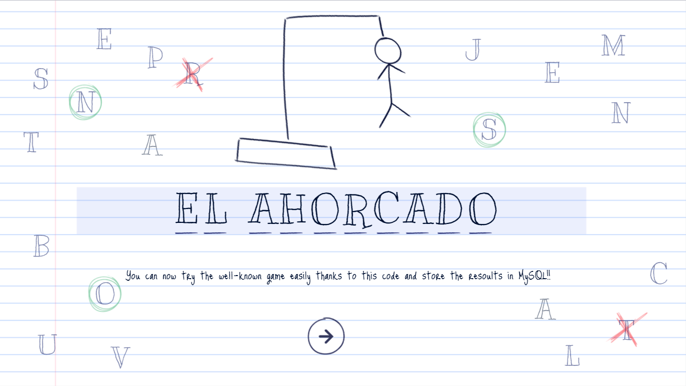
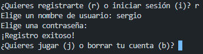
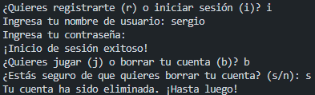
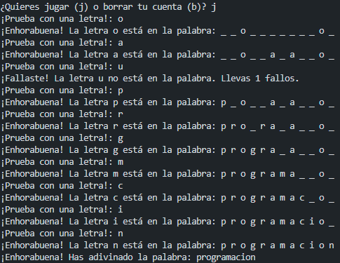
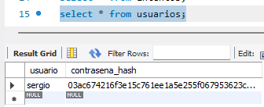

# Hangman Game: Developed with Python and Integrated with MySQL

Welcome to the classic Hangman game, but this time in your own Visual Studio Code environment!

Hangman is a game where you try to guess a word letter by letter, but be careful with your failed attempts or our little Hangman will suffer the consequences!

In this game, the user, their password, the guessing word, and the number of attempts are stored in a MySQL database.



## Contents

1. [How to Play](#how-to-play)
2. [Installation](#installation)
3. [Screenshots](#screenshots)
4. [Contributions](#contributions)
5. [License](#license)

## How to Play

1. **Register or Log In:**
   - When starting the game, you will be given the option to register or log in.
   - If you are a new user, choose "Register" and pick a username and a secure password (it will be encrypted).
   - If you already have an account, select "Log In" and enter your credentials.

2. **Main Options:**
   - After logging in, you will be presented with two options: "Play" or "Delete Account."
   - Choose "Play" to start a new Hangman game.
   - If you decide to "Delete Account," confirmation will be requested, and if accepted, your account and data will be deleted.

3. **Hangman Game:**
   - In the game, try to guess the hidden word by entering letters.
   - Each correct letter will reveal its position in the word.
   - Each incorrect letter will bring you closer to the limit of failed attempts. Watch out for Hangman!

## Installation

1. **Requirements:**
   - Make sure you have Python and MySQL installed on your system.
   - You will also need the Python extension in Visual Studio Code.

2. **Clone the Repository:**
   ```bash
   git clone https://github.com/SergioPinilla04/Python_web

3. **MySQL Setup:**
    - Run the provided SQL script "[ahorcado.sql](./ahorcado.sql)".

4. **Run the Game:**
    - In Visual Studio code, run the script "[ahorcado5.py](./ahorcado5.py)".

## Screenshots

1. **Registration:**

    

2. **Log in and delete account**

    

3. **Game:**

    

4. **Database:**

     [Attempts](./img/attempts.png)

## Contributions

Feel free to contribute to the development of the game. You can open issues to report bugs or suggest new features.

## License

This work is licensed under CC BY-NC-SA 4.0. To view a copy of this license, visit http://creativecommons.org/licenses/by-nc-sa/4.0/
